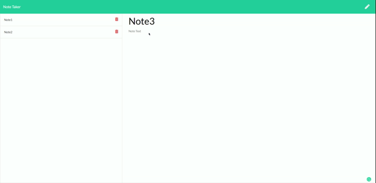

# Note taker


The project can be used to take notes  and save them to a database (json file) and also delete the notes. If there are no saved notes "No Saved Notes" will display where the notes should be.

## Table of Contents
-[Installation](#installation)

-[Usage](#usage)

-[Credits](#credits)

-[Test](#test)

## Deployed Link:

https://immense-crag-56141.herokuapp.com/



## Installation:

**How to install the project:** Clone from this repository. Open in your text editor and run:

```
npm install
```

This will install the necessary packages. Once installed run:

```
node server.js
```

Navigate to your browser and type "http://localhost:PORT" => replace PORT with whatever port you have chosen to run the server on.

## Credits:

**Credits to contributors:** N/A

